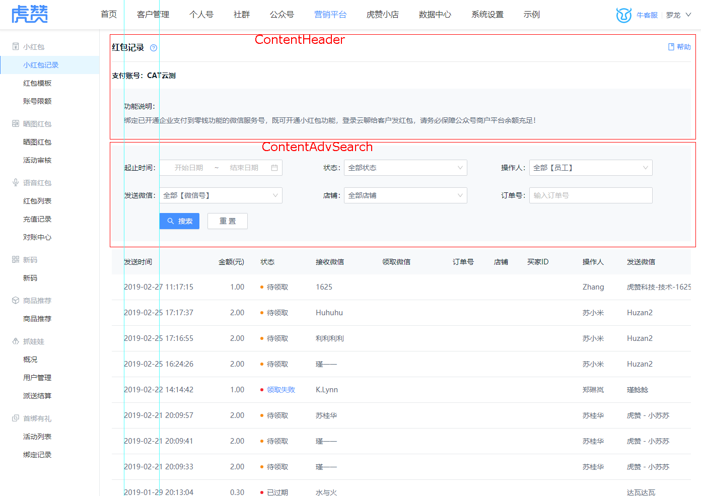
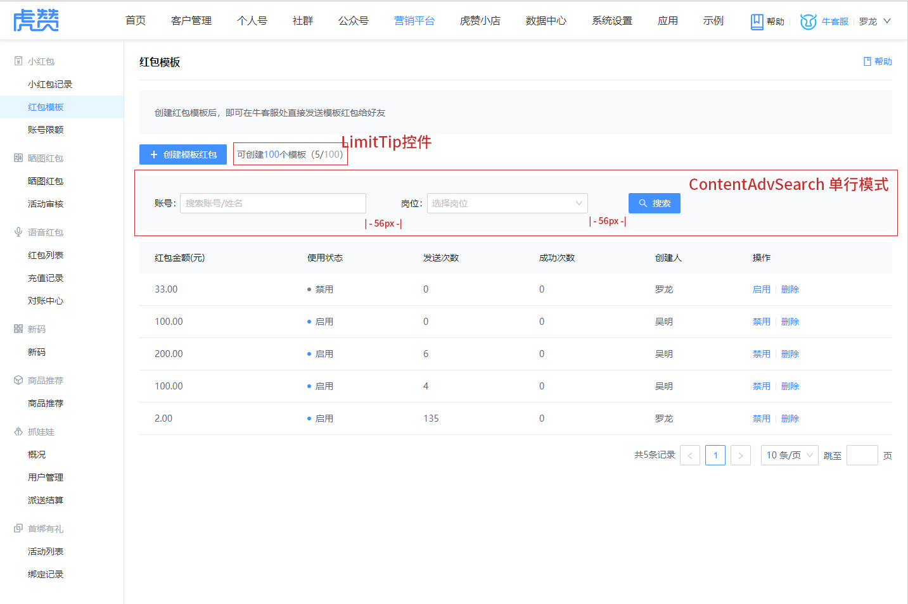
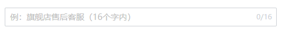

## 页面
页面的间隔都是8px的倍数，一般是16px.
详细的UI设计规范，参见 [UI 规范](https://lanhuapp.com/web/#/item/project/board?pid=eae1207f-b117-430b-9c42-f50b92af5f37)

### 列表
    列表页一般由ContentHeader、ContentAdvSearch控件、表格组成
    整合页面看起来2个参考线，见图中的绿色的参考线


### 列表2
    和上面的列表不一样的地方，在于有操作按钮，单行搜索，数量提示,
    创建按钮一例使用图标



### 表格内的数据规范
| 列 | 对齐方式 | 其它 |
| ------ | ------ | -- |
| 默认 | 左对齐 |
| 金额 | 右对齐 | 列头加(元)，注意是小括号，如：单价(元) |
| 数字 | 居中对齐 |


## 自定义控件

### 扩展Ant Design控件
派生于Ant Design的控件，在原有的控件上，增加了新的功能
#### HzInput
比Ant Design 控件，多了一个字数限制的效果，使用和Input一样，设置了`maxLength`属性，就会出现下面的效果，效果图如下：  

``` javascript
import HzInput from '@/components/HzInput'
```
``` html
<HzInput placeholder="例：旗舰店售后客服（16个字内）" maxLength={16}/>
```
